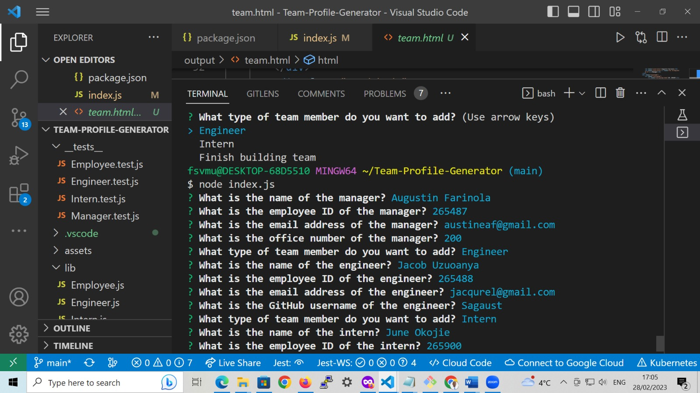
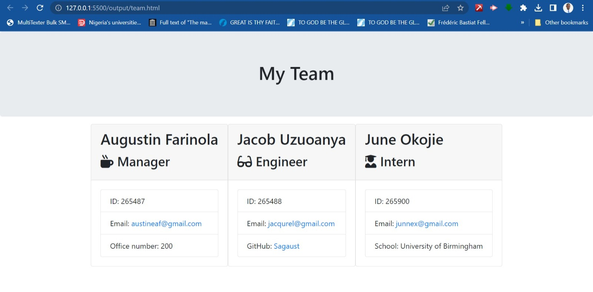
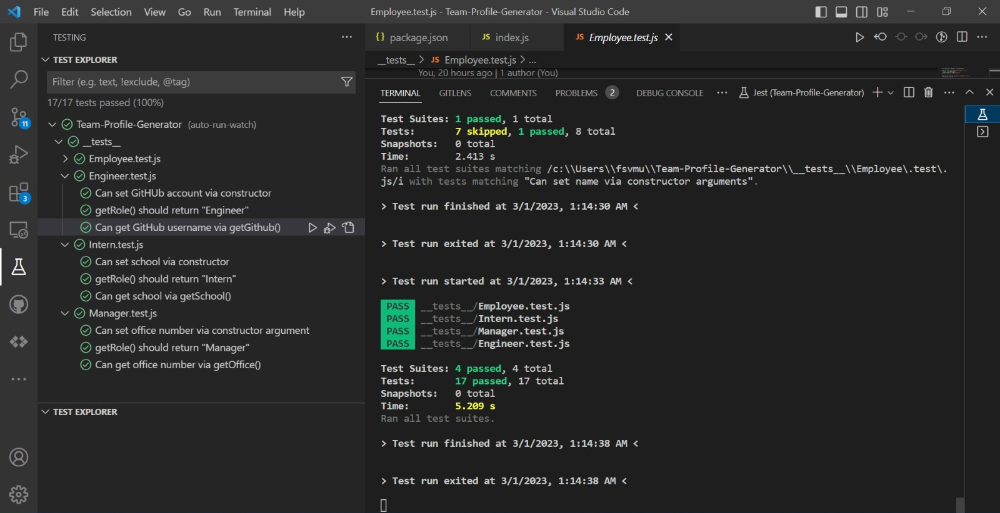

Team Profile Generator
==========================================================

Description
-----------

This Node.js command-line application accepts user input about team members and generates an HTML webpage displaying a summary for each team member. The application has the following functionality:

* The user is prompted to enter the team manager’s name, employee ID, email address, and office number.
* The user is presented with a menu with the option to:
  * Add an engineer
  * Add an intern
  * Finish building the team
* When the user selects the engineer option, the user is prompted to enter the engineer's name, ID, email, and GitHub username.
* When the user selects the intern option, the user is prompted to enter the intern's name, ID, email, and school.
* When the user decides to finish building the team, the application generates an HTML file that displays a summary for each team member.

User Story
----------

AS A manager, I WANT to generate a webpage that displays my team's basic info SO THAT I have quick access to their emails and GitHub profiles.

Table of Contents
-----------------

- Installation
* Usage
* License
* Contributing
* Tests
* Questions

Installation
------------

To install the necessary dependencies, run the following command:
"npm install"

This will install the following npm packages:

* Inquirer - used to prompt the user for information about team members.
* Jest - used to run the test suite for the application.

Usage
-----

To run the application, use the following command:

"node index.js"

This will start the application and prompt the user for information about team members. Once the user has finished entering information for all team members, the application will generate an HTML file in the output folder.

License
-------

This project is licensed under the MIT license.

Contributing
------------

Contributions are welcome. Feel free to open a pull request or branch from this repository.

Tests
-----

This application includes a test suite that can be run using the following command:

To use Jest to test the unit tests, run the following command:
jest test

